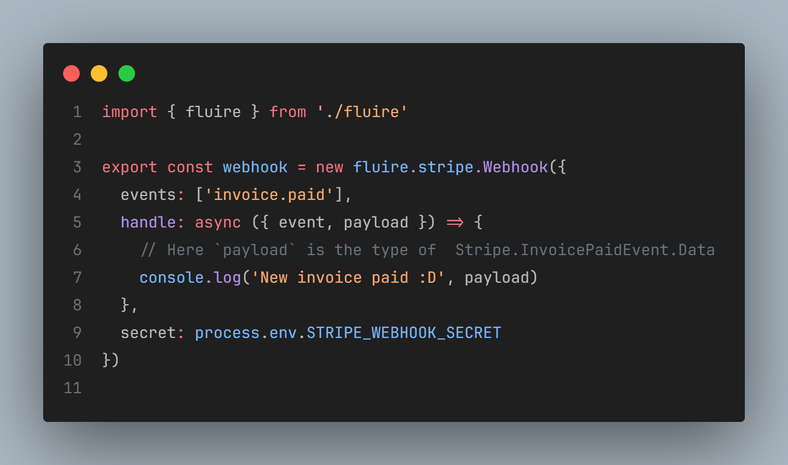

  

<h3 align="center">Fluire</h3>

    Payments-as-Code solution for developers.
     
    <a href="https://github.com/fluiredev/fluire"><strong>Learn more »</strong></a>
     
     
    <a href="#introduction"><strong>Introduction</strong></a> ·
    <a href="#features"><strong>Features</strong></a>

## Introduction

Fluire is a Payments-as-Code solution for developers. It is built to make your life easier when dealing with payment providers (by now, only Stripe is supported).

## Features

- Typesafe Webhooks

  
  

<!-- Thanks https://github.com/dubinc/dub for the readme inspiration --> 